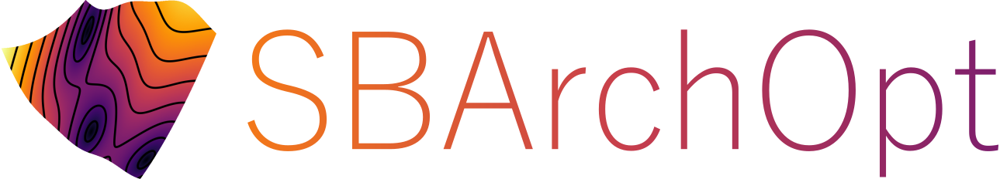

# SBArchOpt: Surrogate-Based Architecture Optimization

SBArchOpt (es-bee-ARK-opt) provides a set of classes and interfaces for applying Surrogate-Based Optimization (SBO)
for system architecture optimization problems:

- Expensive black-box problems: evaluating one candidate architecture might computationally expensive
- Mixed-discrete design variables: categorical architectural decisions mixed with continuous sizing variables
- Hierarchical design variables: decisions can deactivate/activate (parts of) downstream decisions
- Multi-objective: stemming from conflicting stakeholder needs
- Subject to hidden constraints: simulation tools might not converge for all design points

Surrogate-Based Optimization (SBO) aims to accelerate convergence by fitting a surrogate model
(e.g. regression, gaussian process, neural net) to the inputs (design variables) and outputs (objectives/constraints)
to try to predict where interesting infill points lie. Potentially, SBO needs about one or two orders of magnitude less
function evaluations than Multi-Objective Evolutionary Algorithms (MOEA's) like NSGA2. However, dealing with the
specific challenges of architecture optimization, especially in a combination of the challenges, is not trivial.
This library hopes to support in doing this.

The library provides:

- A common interface for defining architecture optimization problems based on [pymoo](https://pymoo.org/)
- Sampling and correction algorithms for hierarchical design spaces
- Support in using Surrogate-Based Optimization (SBO) algorithms:
  - Implementation of a basic SBO algorithm
  - Connectors to various external SBO libraries
- Analytical and realistic test problems that exhibit one or more of the architecture optimization challenges

## Installation

First, create a conda environment (skip if you already have one):
```
conda create --name opt python=3.11
conda activate opt
```

Then install the package:
```
conda install "numpy<2.0"
pip install sb-arch-opt
```

Note: there are optional dependencies for the connected optimization frameworks and test problems.
Refer to their documentation for dedicated installation instructions.

## Citing

If you use SBArchOpt in your work, please cite it:

Bussemaker, J.H., (2023). SBArchOpt: Surrogate-Based Architecture Optimization. Journal of Open Source Software, 8(89),
5564, DOI: [10.21105/joss.05564](https://doi.org/10.21105/joss.05564)

Bussemaker, J.H., et al., (2025). System Architecture Optimization Strategies: Dealing with Expensive Hierarchical
Problems. Journal of Global Optimization, 91(4), 851-895.
DOI: [10.1007/s10898-024-01443-8](https://link.springer.com/article/10.1007/s10898-024-01443-8)

Bussemaker, J.H., et al., (2024). Surrogate-Based Optimization of System Architectures Subject to Hidden Constraints.
In AIAA AVIATION 2024 FORUM. Las Vegas, NV, USA.
DOI: [10.2514/6.2024-4401](https://arc.aiaa.org/doi/10.2514/6.2024-4401)

## Usage

See also the tutorial(s):

- [SBArchOpt Tutorial](tutorial.ipynb): optimization, implementing new problems

### Connecting to Optimization Frameworks

Interfaces to optimization frameworks are located in the `sb_arch_opt.algo` module.
Each framework has a dedicated readme file with instructions on how to use and how to install the framework:

- [pymoo](algo/pymoo.md): evolutionary optimization framework with state-of-the-art (multi-objective) algorithms
- [ArchSBO](algo/arch_sbo.md): SBO implementation for architecture optimization in this repository
- [BoTorch (Ax)](algo/botorch.md): Bayesian Optimization framework based on PyTorch developed by Meta
- [Trieste](algo/trieste.md): Bayesian Optimization framework based on Tensorflow developed by Secondmind Labs
- [HEBO](algo/hebo.md): Bayesian Optimization algorithm developed by Huawei Noahs Ark DMnR lab
- [TPE](algo/tpe.md): Tree Parzen Estimator algorithm
- [Egor](algo/egor.md): SBO algorithm written in Rust developed by ONERA

Following proprietary frameworks are also integrated:

- [SEGOMOE](algo/segomoe.md): SBO algorithm with Mixture of Experts developed by ONERA and ISAE-SUPAERO
- [SMARTy](algo/smarty.md): surrogate modeling toolbox with SBO functionality developed by the DLR

Optimization framework dependencies (except pymoo) are always optional! Therefore, when installing SBArchOpt, the
interfaces to optimization frameworks are probably not working yet.

### Test Problems

For an overview of the available test problems and how to use them, see:
[Overview of Test Problems in SBArchOpt](test_problems.md)

### Implementing an Architecture Optimization Problem

To implement an architecture optimization problem, create a new class extending the `ArchOptProblemBase` class.
You then need to implement the following functionality:

- Design variable definition in the `__init__` function using `Variable` classes (in `pymoo.core.variable`)
- Evaluation of a design vector in `_arch_evaluate`
- Correction (imputation/repair) of a design vector in `_correct_x`
  - Note that this function is only used if `all_discrete_x` (as returned by `_gen_all_discrete_x`) is not available
    or  `design_space.use_auto_correction` is set to `False`
- Return which variables are conditionally active in `_is_conditionally_active`
- An (optional) interface for implementing intermediate storage of problem-specific results (`store_results`), and
  restarting an optimization from these previous results (`load_previous_results`)
- A unique class representation in `__repr__`

Design variables of different types are defined as follows:

- Continuous (`Real`): any value between some lower and upper bound (inclusive)
  --> for example [0, 1]: 0, 0.25, .667, 1
- Integer (`Integer` or `Binary`): integer between 0 and some upper bound (inclusive); ordering and distance matters
  --> for example [0, 2]: 0, 1, 2
- Categorical (`Choice`): one of n options, encoded as integers; ordering and distance are not defined
  --> for example [red, blue, yellow]: red, blue (to get associated categorical values, use `get_categorical_values`)

The input to the `_arch_evaluate` function has not yet been imputed (however discrete variables have been rounded and
therefore have integer values). Output of the evaluation should be provided as follows:

- Objective function `f` as minimization
- Inequality constraints `g` according to `g(x) <= 0` means "satisfied"
- Equality constraints `h` according to `h(x) = 0` means "satisfied"

Note: if you are implementing a test problem where it is relatively cheap to determine the "real" Pareto front, you
may use the `sb_arch_opt.pareto_front.CachedParetoFrontMixin` mixin. This mixin adds functions for automatically finding
the Pareto front, so the `pareto_front()` function can be used.

Example:

```python
import numpy as np
from typing import List
from sb_arch_opt.problem import ArchOptProblemBase
from sb_arch_opt.pareto_front import CachedParetoFrontMixin
from pymoo.core.variable import Real, Integer, Choice


class DemoArchOptProblem(CachedParetoFrontMixin, ArchOptProblemBase):
    """
    An example of an architecture optimization problem implementation.
    
    NOTE: only use CachedParetoFrontMixin if it is cheap to find the Pareto front (mostly the case for test functions)!
    """

    def __init__(self):
        super().__init__(des_vars=[
            Real(bounds=(0, 1)),
            Integer(bounds=(0, 3)),  # [0, 1, 2, 3]
            Choice(options=['A', 'B', 'C']),
        ], n_obj=1)

    def _arch_evaluate(self, x: np.ndarray, is_active_out: np.ndarray, f_out: np.ndarray, g_out: np.ndarray,
                       h_out: np.ndarray, *args, **kwargs):
        """
        Implement evaluation and write results in the provided output matrices:
        - x (design vectors): discrete variables have integer values, imputed design vectors can be output here
        - is_active (activeness): vector specifying for each design variable whether it was active or not
        - f (objectives): written as a minimization
        - g (inequality constraints): written as "<= 0"
        - h (equality constraints): written as "= 0"
        """

        # Correct the input design vectors (if not too expensive)
        self._correct_x_impute(x, is_active_out)

        # Example of how to set objective values
        f_out[:, 0] = np.sum(x ** 2, axis=1)

    def _correct_x(self, x: np.ndarray, is_active: np.ndarray):
        """
        Fill the activeness matrix and (if needed) correct any design variables that are partially inactive.
        Imputation of inactive design variables is always applied after this function.
        
        Only needed if no explicit design space model is given.
        Only used if not all discrete design vectors `all_discrete_x` is available OR
        `self.design_space.use_auto_corrector = False` OR `self.design_space.needs_cont_correction = True`:
        --> set `self.design_space.use_auto_corrector = False` to prevent using an automatic corrector
        --> set `self.design_space.needs_cont_correction = True` if automatic correction can be used but also continuous
            variables might have to be corrected (the automatic corrector only corrects discrete variables)
        """

        # Get categorical values associated to the third design variables (i_dv = 2)
        categorical_values = self.get_categorical_values(x, i_dv=2)

        # Set second design variable inactive if value is other than A
        is_active[:, 1] = categorical_values != 'A'
        
        # Set inactive variables to some predefined value (can be left out, as this is also done by `_impute_x`)
        x[~is_active] = 0
    
    def _is_conditionally_active(self) -> List[bool]:
        """Return for each design variable whether it is conditionally active (i.e. might become inactive). Not needed
        if an explicit design space is provided."""

    def store_results(self, results_folder):  # Optional
        """Implement this function to enable problem-specific intermediate results storage"""

    def load_previous_results(self, results_folder):  # Optional
        """Implement this function to enable problem-specific results loading for algorithm restart"""

    def _get_n_valid_discrete(self) -> int:  # Optional
        """Return the number of valid discrete design points (ignoring continuous dimensions); enables calculation of
        the imputation ratio"""

    def _gen_all_discrete_x(self):  # -> Optional[Tuple[np.ndarray, np.ndarray]]
        """Generate all possible discrete design vectors (if available). Returns design vectors and activeness
        information."""

    def might_have_hidden_constraints(self):  # Optional
        """By default, it is assumed that at any time one or more points might fail to evaluate (i.e. return NaN).
        If you are sure this will never happen, set this to False. This information can be used by optimization
        algorithms to speed up the process."""
        return True

    def get_failure_rate(self) -> float:  # Optional
        """Estimate the failure rate: the fraction of randomly-sampled points of which evaluation will fail"""

    def get_n_batch_evaluate(self) -> int:  # Optional
        """If the problem evaluation benefits from parallel batch process, return the appropriate batch size here"""

    def __repr__(self):
        """repr() of the class, should be unique for unique Pareto fronts"""
        return f'{self.__class__.__name__}()'


if __name__ == '__main__':
    # Print some statistics about the problem
    DemoArchOptProblem().print_stats()
```

### Architecture Optimization Problem with an Explicit Design Space Model

If you are implementing an architecture optimization problem with design space hierarchy (i.e. some of your design
variables are conditionally active), you could instead of implementing the `_correct_x` function yourself, also specify
the hierarchical structure explicitly using `ExplicitArchDesignSpace`. To do this, you have to specify:
1. Design variables using `ContinuousParam`, `IntegerParam`, or `CategoricalParam` (note: these are different classes
   than when you use the pymoo API for the implicit formulation above!)
2. Conditions specifying which design variable is active at which condition
3. Optionally, you can also add value constraints, which explicitly forbid some condition, such as the simultaneous
   occurrence of two design variable options

You can then pass the explicit design space definition as the first argument to the `ArchOptProblemBase` class.
Example usage:
```python
import numpy as np
from sb_arch_opt.design_space_explicit import *
from sb_arch_opt.problem import ArchOptProblemBase


class DemoExplicitArchOptProblem(ArchOptProblemBase):
    """
    An example of an architecture problem implementation using an explicit design space definition.
    Using this, there is no need to implement _correct_x, _get_n_valid_discrete, and _gen_all_discrete_x.
    """

    def __init__(self):
        # Specify a design space with a categorical, an integer, and a continuous variable
        ds = ExplicitArchDesignSpace([
            CategoricalParam('cat', ['A', 'B', 'C']),
            IntegerParam('int', 0, 3),
            ContinuousParam('cont', 0, 1),
        ])
        
        # Activate int and cont conditionally
        ds.add_conditions([
            InCondition(ds['int'], ds['cat'], ['A', 'B']),  # Activate int if cat == A or cat == B
            EqualsCondition(ds['cont'], ds['cat'], 'A'),  # Activate cont if cat == A
        ])
        
        # Explicitly forbid int from being 3 if cat == B
        # You can also specify the values as a list to constrain more than one value at a time
        ds.add_value_constraint(ds['int'], 3, ds['cat'], 'B')
        
        super().__init__(ds, n_obj=1)

    def _arch_evaluate(self, x: np.ndarray, is_active_out: np.ndarray, f_out: np.ndarray, g_out: np.ndarray,
                       h_out: np.ndarray, *args, **kwargs):
        """
        Implement evaluation and write results in the provided output matrices:
        - f (objectives): written as a minimization
        - g (inequality constraints): written as "<= 0"
        - h (equality constraints): written as "= 0"
        
        For the explicit design space definition, x and is_active_out are already imputed. If anything is wrong, then
        you should change the design space definition rather than trying to fix it here.
        """
        
        # Example of how to set objective values
        f_out[:, 0] = np.sum(x ** 2, axis=1)

    def __repr__(self):
        """repr() of the class, should be unique for unique Pareto fronts"""
        return f'{self.__class__.__name__}()'
```

Under the hood, the explicit design space definition uses [ConfigSpace](https://automl.github.io/ConfigSpace/), a
library for modeling hierarchical design spaces.
More details on how to [specify conditions here](https://automl.github.io/ConfigSpace/main/api/conditions.html).
More details on how to [specify value constraints (forbidden clauses) here](https://automl.github.io/ConfigSpace/main/api/forbidden_clauses.html).

## Architecture Optimization Measures

To increase the efficiency (and in some cases make it possible at all) of architecture optimization problems, several
measures have been identified. Each of these measures can be implemented independently, however the more, the better.
Architecture optimization aspects and mitigation measures:

| Aspect                  | Problem-level                                                  | MOEA                                       | SBO                                                                                                                  |
|-------------------------|----------------------------------------------------------------|--------------------------------------------|----------------------------------------------------------------------------------------------------------------------|
| Mixed-discrete (MD)     | Convert float to int; high distance correlation                | Support discrete operations                | Cont. surrogates; specific kernels; one-hot encoding; force new infill point selection                               |
| Multi-objective (MO)    |                                                                | Prioritize w.r.t. distance to Pareto front | Multi-objective infill criteria                                                                                      |
| Hierarchical (HIER)     | Imputation; activeness; design space def; low imputation ratio | Impute during sampling, evaluation         | Impute during sampling, evaluation, infill search; hierarchical kernels; design space def; discard non-canonical DVs |
| Hidden constraints (HC) | Catch errors and return NaN                                    | Extreme barrier approach                   | Process NaNs; predict hidden constraints area                                                                        |
| Expensive (EXP)         | Support parallel evaluation                                    | Same as for SBO                            | Intermediate results storage; resuming optimizations; ask-tell interface; batch infill                               |

Architecture optimization measure implementation status
(Lib = yes, in the library; SBArchOpt = yes, in SBArchOpt; N = not implemented; NbP = not implemented but possible to implement; empty = unknown or not relevant):

| Aspect: measure                        | pymoo     | ArchSBO   | SEGOMOE   | BoTorch (Ax) | Trieste   | HEBO      | SMARTy    | TPE       |
|----------------------------------------|-----------|-----------|-----------|--------------|-----------|-----------|-----------|-----------|
| MD: continuous surrogates              |           | SBArchOpt | N         | Lib          | Lib       | Lib       | Lib       |           |
| MD: kernels                            |           | SBArchOpt | Lib       | Lib          | N         | N         | N         |           |
| MD: one-hot encoding                   |           | N         | Lib       | N            | N         | N         | N         |           |
| MD: force new infill point selection   |           | SBArchOpt | N         | N            | N         | N         | N         |           |
| MO: multi-objective infill             |           | SBArchOpt | Lib       | Lib          | Lib       | NbP       | Lib       | N         |
| HIER: imputation during sampling       | SBArchOpt | SBArchOpt | SBArchOpt | N            | NbP       | SBArchOpt | N         | SBArchOpt |
| HIER: imputation during evaluation     | SBArchOpt | SBArchOpt | SBArchOpt | N            | SBArchOpt | SBArchOpt | N         | SBArchOpt |
| HIER: imputation during infill search  |           | SBArchOpt | N         | N            | N         | N         | N         | N         |
| HIER: discard non-canonical DVs        | N         | N         | N         | Lib          | N         | N         | N         | N         |
| HIER: kernels                          |           | SBArchOpt |           | N            | N         | N         | N         | N         |
| HIER: design space def (list)          | N         | SBArchOpt |           | NbP          | N         | N         | N         | N         |
| HIER: design space def (tree)          | N         | SBArchOpt |           | NbP          | N         | N         | N         | N         |
| HIER: design space def (acyclic graph) | N         | SBArchOpt |           | N            | N         | N         | N         | N         |
| HIER: design space def (graph)         | N         | N         | N         | N            | N         | N         | N         | N         |
| HC: process NaNs                       | Lib       | SBArchOpt | Lib       | Lib          | Lib       | Lib       | N         | Lib       |
| HC: predict area                       |           | SBArchOpt | Lib       | N            | Lib       | N         | N         | Lib       |
| EXP: intermediate result storage       | SBArchOpt | SBArchOpt | Lib       | NbP          | Lib       | NbP       | NbP       | SBArchOpt |
| EXP: resuming optimizations            | SBArchOpt | SBArchOpt | Lib       | NbP          | Lib       | NbP       | NbP       | SBArchOpt |
| EXP: ask-tell interface                | Lib       | SBArchOpt | NbP       | NbP          | NbP       | Lib       | N         | SBArchOpt |
| EXP: batch infill                      | Lib       | SBArchOpt | N         | Lib          | NbP       | Lib       | N         | NbP       |

Following Python SBO frameworks are not implemented, however deserve an acknowledgment:

- [pysamoo](https://anyoptimization.com/projects/pysamoo/): generic acceleration of (multi-objective) evolutionary
  algorithms by surrogate assistance (incompatible with pymoo 0.6.0 [2023-03-13])
- [SMAC3](https://automl.github.io/SMAC3/)
- [Dragonfly](https://github.com/dragonfly/dragonfly)
- [Emukit](https://emukit.github.io/)
- [ParMOO](https://github.com/parmoo/parmoo)
- [skopt](https://scikit-optimize.github.io/stable/): does not support multi-objective constrained optimization
- [pySOT](https://pysot.readthedocs.io/): does not support mixed-discrete, multi-objective optimization
- [MOBOpt](https://github.com/ppgaluzio/MOBOpt)
- [Bayesian Optimization](https://github.com/fmfn/BayesianOptimization): only single-objective
- [OpenBox](https://open-box.readthedocs.io/en/latest/)
- [POT (Powerful Optimization Toolbox)](https://arc.aiaa.org/doi/10.2514/1.J056486): DLR-internal continuous, multi-objective, multi-fidelity SBO library that also supports hidden constraints
- [BoFire](https://github.com/experimental-design/bofire): multi-objective, mixed-discrete (incl. categorical) BO (using BoTorch) with chemical encodings/kernels, various structural constraints (categorical exclusion, nonlinear/linear constraints, choose n of k constraint) and optimal DoE
